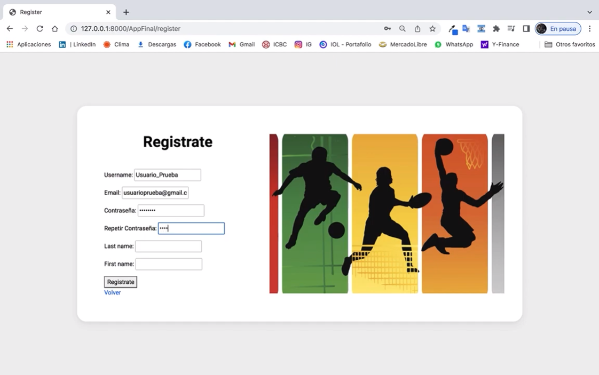

# ProyectoFinal
Proyecto Final CoderHouse - Python
## Video de Youtube:
[](https://www.youtube.com/watch?v=uuzm1HjLBVA)

Instalacion
Para instalar y ejecutar:

1.  Chequear version de Python:
NOTA: se recomienda usar una versión de Python 3.8 o superior.

in *nix systems:

### `> python --version`
### `> Python 3.8.0`
in windows:

### `c:\> py --version`
### `c:\> Python 3.8.0`

2.  Instalar dependencias
Se necesita ejecutar pip install, verificar estar en la carpeta del proyecto:

### `> pip install -r requirements.txt`
## Project structure

``` 
├── #AppFinal
│    ├── #migrations
│    ├── #static/AppFinal
│    ├── #templates/AppFinal
│    ├──__init__.py
│    ├──settings.py
│    ├──admin.py
│    ├──apps.py
│    ├──forms.py
│    ├──models.py
│    ├──tests.py
│    ├──urls.py
│    └──views.py
├── # ProyectoFinal
│    ├──__init__.py
│    ├──asgi.py
│    ├──settings.py
│    ├──urls.py
│    └──wsgi.py
├── # media/avatares
│   
└── # manage.py

```
Algunos sistemas operativos tal vez requieran usar pip3 en vez de pip.

3.  Setting Up Aplicacion Django
Una vez finalizada la instalacion de dependencias hay que ejecutar los comandos de Django.

Migrations
Inicializar la base datos:

### `> python manage.py migrate`

windows:
### `c:\> py manage.py migrate`

ejecutar el test server
### `> python manage.py runserver`

windows:

### `c:\> py manage.py runserver`

# create admin account

### `python manage.py createsuperuser`
